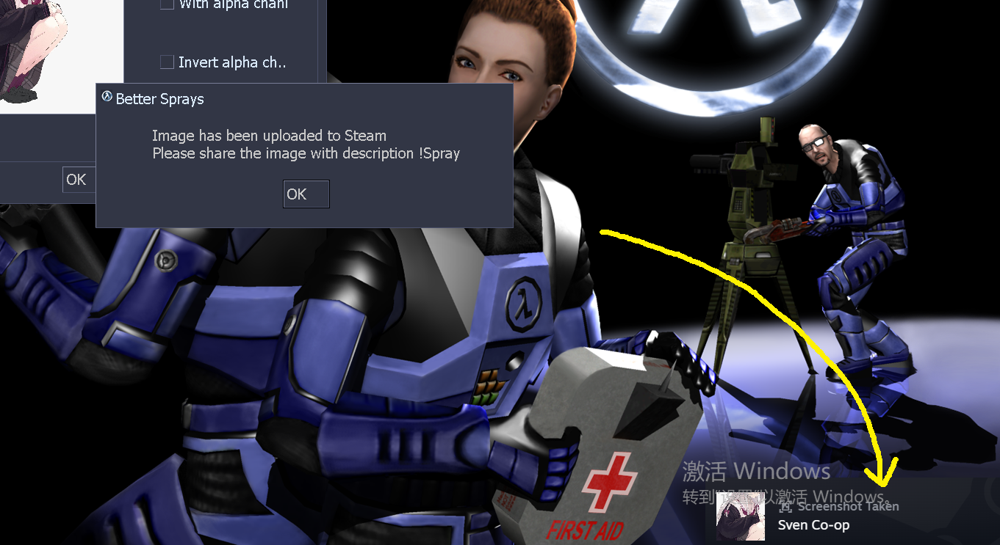
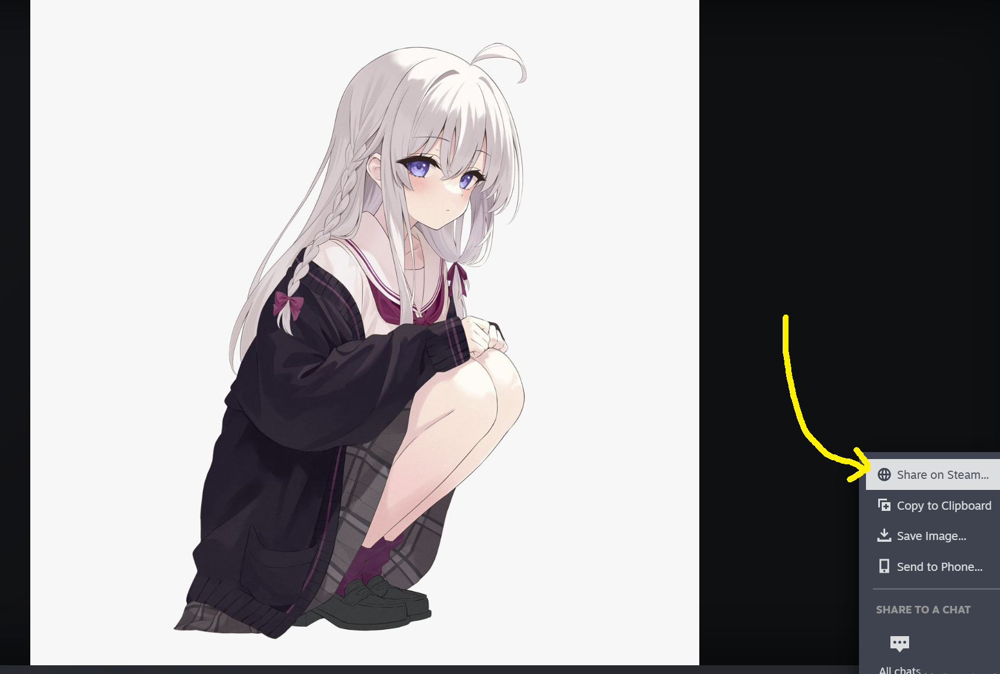
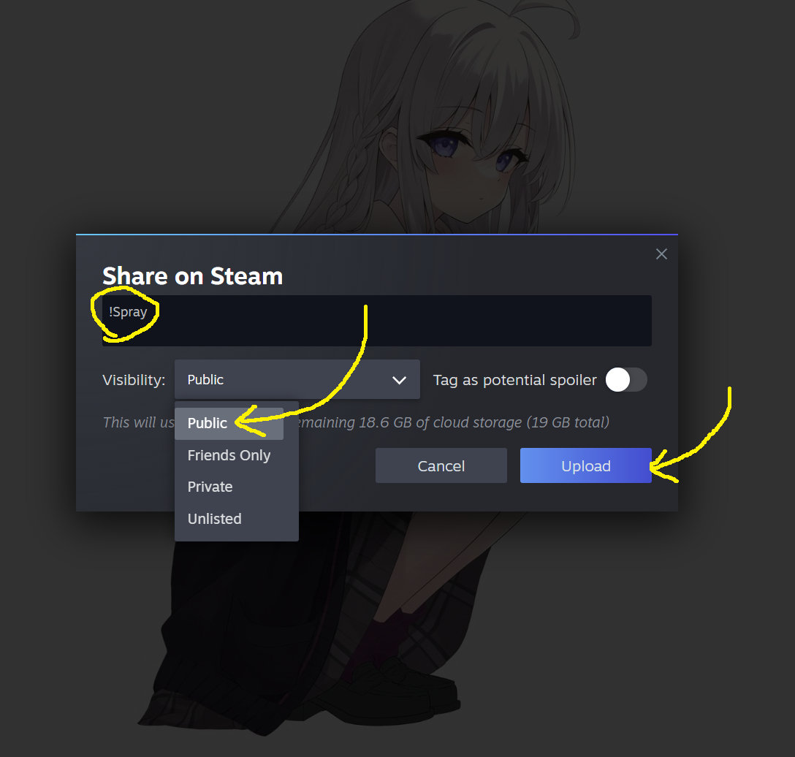
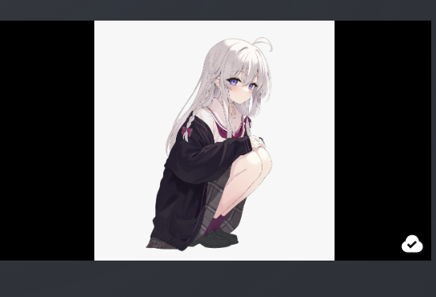

[Back to README](../../README.md) | [中文](../zh-CN/features.md)

# Features

BetterSpray enhances spray loading, conversion and sharing. See
[Installation](installation.md) for runtime dependencies and enabling the plugin.

## Images and local sprays

- Load JPG, PNG, BMP, TGA and WEBP images, including alpha channels.
- Convert selected images to `custom_sprays/<SteamID64>.jpg` in the engine's
  `GAMEDOWNLOAD` directory (normally `svencoop_downloads/` for Sven Co-op).
- Decode images on worker threads and upload textures on the game thread.
- Use double-width images whose left half is RGB and right half is the alpha mask.
- Normalize images and encode transparency with the plugin's background-marker format.
- Write `tempdecal.wad` for players without BetterSpray. The WAD uses a reduced palette;
  alpha below 125 becomes transparent. A game restart may be needed to refresh an
  already loaded WAD cache.

The integrated settings and task-list UI requires VGUI2Extension. The plugin's
existing engine compatibility table is in the README; the packaged catalog's exact
coverage is described in [gamedata](gamedata.md).

### Legacy GoldSrc

On `hl-3248` ~ `hl-8684` the engine exposes no per-player SteamID, so only your own
high-res spray renders and other players keep the engine's WAD decal. Steam cloud
sharing below is unavailable there; see [gamedata](gamedata.md#per-player-identity-on-legacy-goldsrc).

## Steam cloud sharing

1. Select and upload the spray through the plugin.
2. In Steam's screenshot library, set its description to `!Spray` and share it as Public.
3. Confirm it appears on your Sven Co-op screenshots page
   (`https://steamcommunity.com/profiles/<SteamID64>/screenshots/?appid=225840&sort=newestfirst&browsefilter=myfiles&view=grid`).
4. Other players with BetterSpray and its runtime dependencies can query and download it.

The downloader selects screenshots whose description starts with `!`.
`!Spray` is the recommended description. Local caching avoids downloading the same
spray repeatedly during normal use.

